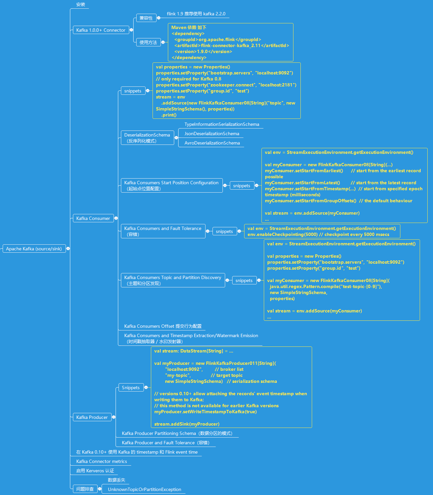

# Apache Kafka Connector（Apache Kafka 连接器）
从 Kafka 中读取数据，或者写入数据到 Kafka 中.

## 知识

### 知识点
* Installing Apache Kafka（安装 Kafka）
* Kafka 1.0.0+ Connector
    * Compatibility（兼容性，兼容性矩阵图了解）
    * Migrating Kafka Connector from 0.11 to universal（版本迁移）
    * Usage（使用方法）
* Kafka Consumer（消费者，也就是我们的 Source）
    * The DeserializationSchema
    * Kafka Consumers Start Position Configuration（起始点位置配置）
    * Kafka Consumers and Fault Tolerance（容错，各种场景下的容错情况了解）
    * Kafka Consumers Topic and Partition Discovery（主题和分区发现，动态发现主题和分区背后的机制是咋样的，适用于哪些场景）
    * Kafka Consumers Offset Committing Behaviour Configuration（Offset 提交行为配置，了解各种场景下的提交行为，）
    * Kafka Consumers and Timestamp Extraction/Watermark Emission（时间戳抽取器 / 水印发射器）
* Kafka Producer（生产者，也就是我们的 Sink）
    * Kafka Producer Partitioning Scheme（数据分区的模式，数据被发送到哪个分区呢）
    * Kafka Producers and Fault Tolerance（容错，各种场景的了解）
* Using Kafka timestamps and Flink event time in Kafka 0.10（从 0.10+ 可以使用 kafka timestamp 与 flink event time 结合了）
* Kafka Connector metrics（度量，监控必备呀！~）
* Enabling Kerberos Authentication (for versions 0.9+ and above only)（Kerberos 认证）
* Troubleshooting（问题排查）
    * Data loss
    * UnknownTopicOrPartitionException

### 知识图    

## 代码
* [[消费 Kafka 中的数据] ConnectorKafkaConsumer](../../codes/hairless-notes-streaming/src/main/scala/wang/yangting/tech/flink/streaming/scala/connectors/ConnectorKafkaConsumer.scala)

## 建议
学习该小节，强烈建议把该节的如下官方文档详细品味一遍.

## 参考
* <https://ci.apache.org/projects/flink/flink-docs-release-1.9/dev/connectors/>
* <https://ci.apache.org/projects/flink/flink-docs-release-1.9/dev/connectors/kafka.html>
