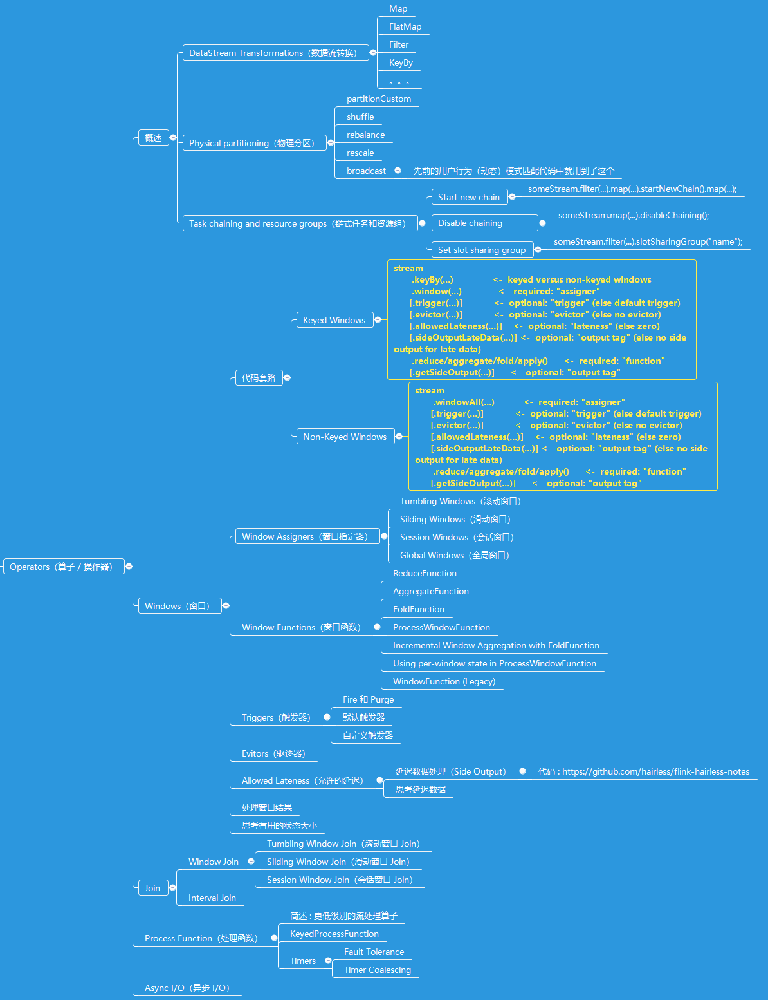

# Operators（操作器 / 算子）

## 知识点

## 概述
[application-development-streaming-operators-overview](application-development-streaming-operators-overview.md)

## 窗口
[application-development-streaming-operators-windows](application-development-streaming-operators-windows.md)

## 代码
* [[获取延迟的数据] WindowGetLateDataAsSideOutput](../../codes/hairless-notes-streaming/src/main/scala/wang/yangting/tech/flink/streaming/scala/operators/window/WindowGetLateDataAsSideOutput.scala)

## 参考
* <https://ci.apache.org/projects/flink/flink-docs-release-1.9/dev/stream/operators/>
