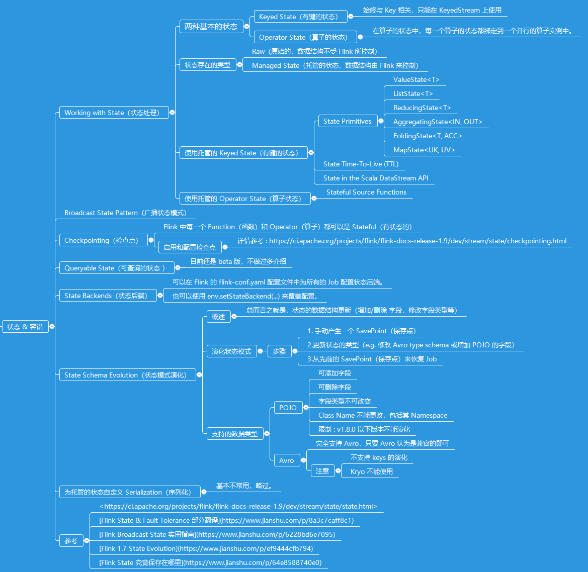

# State & Fault Tolerance（状态 & 容错）

## 知识点

## 代码
* [StateValueStateWithCountWindowAverage（ValueState Demo）](../../codes/hairless-notes-streaming/src/main/scala/wang/yangting/tech/flink/streaming/scala/state/StateValueStateWithCountWindowAverage.scala)

## 参考
* <https://ci.apache.org/projects/flink/flink-docs-release-1.9/dev/stream/state/state.html>
* [Flink State & Fault Tolerance 部分翻译](https://www.jianshu.com/p/8a3c7caff8c1)
* [Flink 1.7 State Evolution](https://www.jianshu.com/p/ef9444cfb794)
* [Flink Broadcast State 实用指南](https://www.jianshu.com/p/6228bd6e7095)
* [Flink 从源码解析State的保存过程](https://www.jianshu.com/p/762c624591d8)
* [Flink State 究竟保存在哪里](https://www.jianshu.com/p/64e8588740e0)
