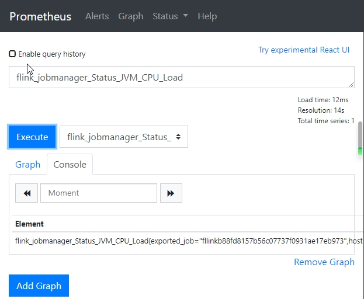
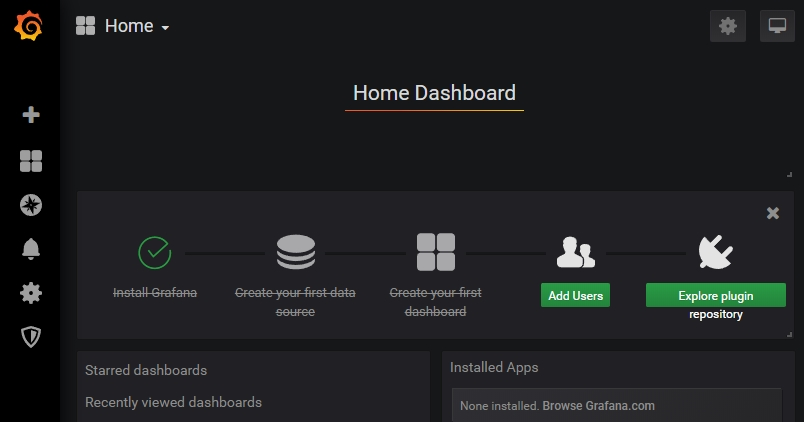
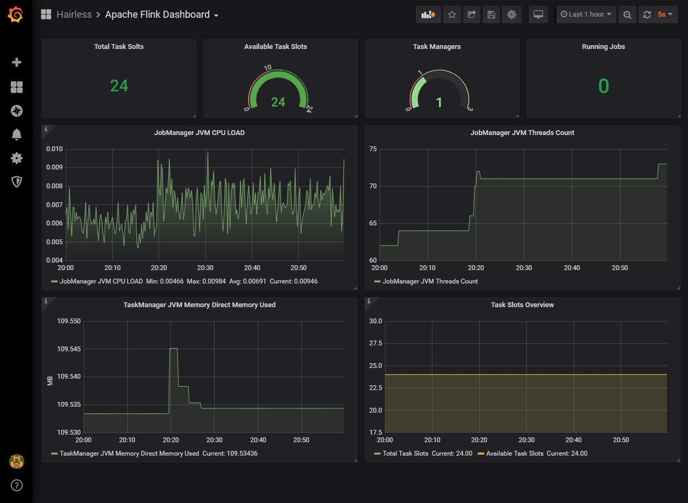

# Apache Flink 集成 Promethues 和 Grafana

Apache Flink 集成 Promethues 和 Grafana, 快速部署, 弄一个 Demo 出来先, 测试一下效果怎么样.

## 环境

### 开发环境
Windows 10 Professional

### 软件版本
* System : Windows 10 Professional （建议用 Linux 更香哟）
* Docker : 19.03.5
* Flink : 1.9.1
* PushGateWay : v1.0.1
* Prometheus : v2.15.1
* Grafana : 6.5.2

## 准备
1. docker network 配置
    ```shell script
    docker network create hairless
    ```
2. prometheus.yml 配置文件增加 PushGateWay 的配置, 这样 Prometheus 才能读取 PushGateWay 的数据 :
    ```yaml
    # my global config
    global:
      scrape_interval:     15s # Set the scrape interval to every 15 seconds. Default is every 1 minute.
      evaluation_interval: 15s # Evaluate rules every 15 seconds. The default is every 1 minute.
      # scrape_timeout is set to the global default (10s).
    
    # Alertmanager configuration
    alerting:
      alertmanagers:
      - static_configs:
        - targets:
          # - alertmanager:9093
    
    # Load rules once and periodically evaluate them according to the global 'evaluation_interval'.
    rule_files:
      # - "first_rules.yml"
      # - "second_rules.yml"
    
    # A scrape configuration containing exactly one endpoint to scrape:
    # Here it's Prometheus itself.
    scrape_configs:
      # The job name is added as a label `job=<job_name>` to any timeseries scraped from this config.
      - job_name: 'prometheus'
    
        # metrics_path defaults to '/metrics'
        # scheme defaults to 'http'.
    
        static_configs:
        - targets: ['localhost:9090']
      
      # PushGateWay Conf
      - job_name: pushgateway
        static_configs:
          - targets: ['vh-hairless-pushgateway:9091']
            labels:
              instance: pushgateway
    ```

## 步骤
1. 复制 /opt/flink-metrics-prometheus-1.9.1.jar 到 Flink 的 lib 目录下去.
2. 配置 flink-conf.yaml, 如下所示
    ```yaml
    metrics.reporter.promgateway.class: org.apache.flink.metrics.prometheus.PrometheusPushGatewayReporter
    metrics.reporter.promgateway.host: localhost
    metrics.reporter.promgateway.port: 9091
    metrics.reporter.promgateway.jobName: flink
    metrics.reporter.promgateway.randomJobNameSuffix: true
    metrics.reporter.promgateway.deleteOnShutdown: false
    ```
3. 启动 Flink 集群
    ```shell script
    start-cluster.bat
    ```
4. 启动 PushGateWay
    ```shell script
    docker run -d --name hairless-pushgateway --network hairless --hostname vh-hairless-pushgateway --network-alias vh-hairless-pushgateway -p 9091:9091 prom/pushgateway:v1.0.1
    ```
5. 启动 Prometheus, 假设 prometheus.yml 文件的目录为 H:\Hairless\Prometheus
    ```shell script
    docker run -d --name hairless-prometheus --network hairless --hostname vh-hairless-prometheus --network-alias vh-hairless-prometheus -p 9090:9090 -v H:\Hairless\Prometheus:/etc/prometheus prom/prometheus:v2.15.1
    ```
6. 启动 Grafana
    ```shell script
    docker run -d --name hairless-grafana --network hairless --hostname vh-hairless-grafana --network-alias vh-hairless-grafana -p 3000:3000 grafana/grafana:6.5.2
    ```

## 验证
1. 验证 PushGateWay : 浏览器访问 http://127.0.0.1:9091  
    
2. 验证 Prometheus : 浏览器访问 http://127.0.0.1:9090  
    
2. 验证 Grafana : 浏览器访问 http://127.0.0.1:3000  
    

## 配置
1. Grafana 集成 Prometheus.
   可参考 <https://www.cnblogs.com/xiangsikai/p/11289333.html>

## 效果


## 感言
图都是自己加上去的,多多参考下下述的官方文档就好了,说简单不简单, 说不复杂也不复杂, 还挺有意思的吧！~

## 参考
* <https://ci.apache.org/projects/flink/flink-docs-release-1.9/monitoring/metrics.html#prometheuspushgateway-orgapacheflinkmetricsprometheusprometheuspushgatewayreporter>
* <https://www.cnblogs.com/xiangsikai/p/11289333.html>